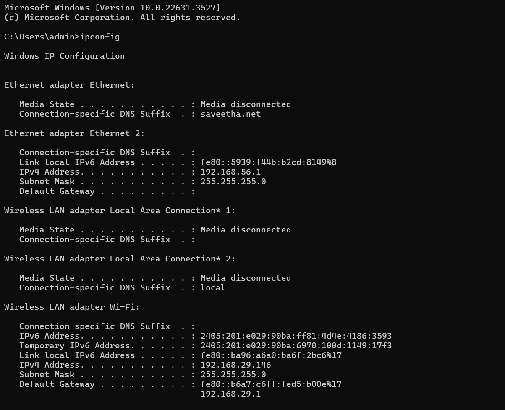
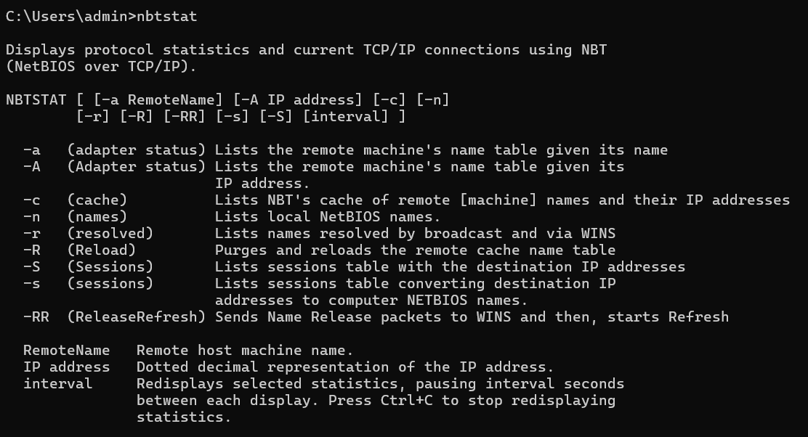
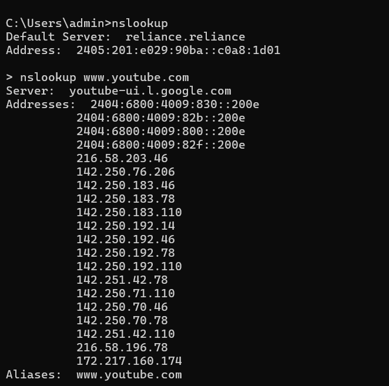
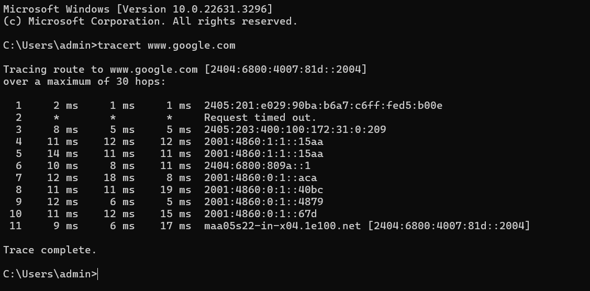
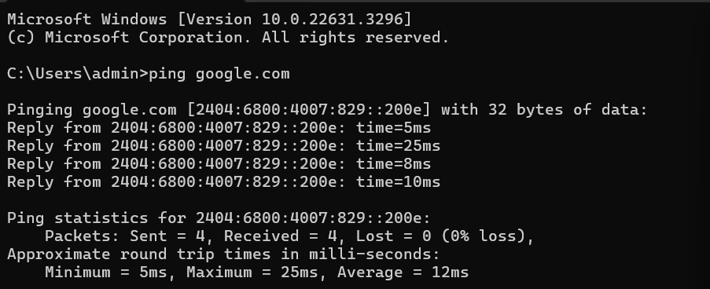
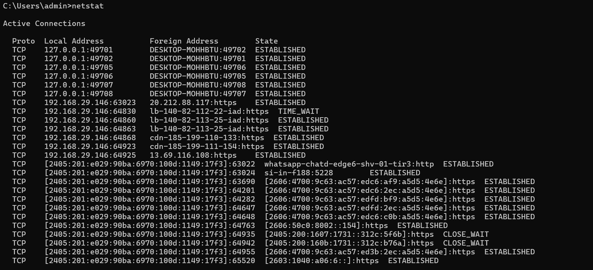
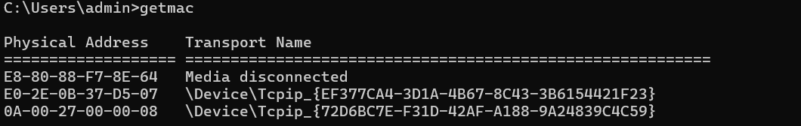

# EX.4 EXECUTION OF NETWORK COMMANDS
## AIM :
Use of Network commands in Real Time environment
## SOFTWARE : 
Command Prompt And Network Protocol Analyzer
## PROCEDURE: 
To do this EXPERIMENT- follows these steps:
 
In this EXPERIMENT- students have to understand basic networking commands e.g cpdump, netstat, ifconfig, nslookup ,traceroute and also Capture ping and traceroute PDUs using a network protocol analyzer 
 
All commands related to Network configuration which includes how to switch to privilege mode
 
and normal mode and how to configure router interface and how to save this configuration to
 
flash memory or permanent memory.
 
This commands includes
 
• Configuring the Router commands
 
• General Commands to configure network
 
• Privileged Mode commands of a router 
 
• Router Processes & Statistics
 
• IP Commands
 
• Other IP Commands e.g. show ip route etc.
 

## OUTPUT:
### IPCONFIG

### NBTSTAT

### NSLOOKUP

### HOSTNAME

### TRACERT

### PING

### NETSTAT

### GETMAC

## RESULT:
Thus Execution of Network commands Performed
